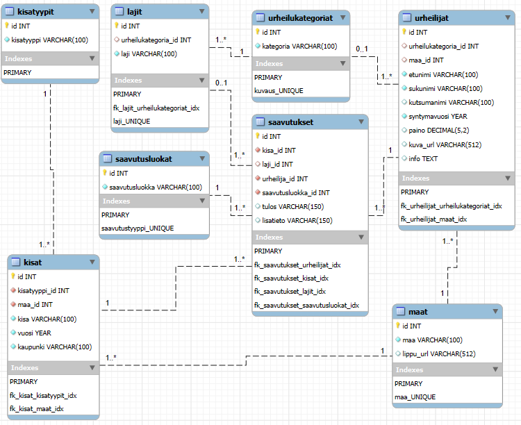

# Legends

A full-stack web application for managing athlete achievements and competition records. Browse Olympic medalists, World Championship winners, and sports legends all in one place.



## Features

- Browse athletes and their achievements across multiple sports
- View competition history (Olympics, World Championships, European Championships)
- Filter by country, sport type, and competition
- Multi-language support with i18next
- RESTful API for easy integration
- Responsive design with Material-UI

## Tech Stack

- **Frontend:** React, Material-UI, React Router, i18next
- **Backend:** Node.js, Express
- **Database:** MySQL/MariaDB

## Getting Started

### Database

```bash
mysql -u root -p < db.sql
```

### Backend

```bash
cd api
npm install
npm start
```

API runs on `http://localhost:3001`

### Frontend

```bash
cd hall-of-fame
npm install
npm start
```

App opens at `http://localhost:3000`

## API Endpoints

The REST API provides the following endpoints:

| Endpoint        | Description                                  |
| --------------- | -------------------------------------------- |
| `/athletes`     | Get all athletes or specific athlete details |
| `/achievements` | Get achievement records and medals           |
| `/competitions` | Get competition information                  |
| `/countries`    | Get country data                             |
| `/sports`       | Get sports disciplines                       |
| `/events`       | Get event details                            |

**Example:**

```bash
GET http://localhost:3001/athletes
GET http://localhost:3001/achievements?athlete_id=1
```

## Project Structure

- `/api` - Express REST API with MVC architecture
- `/hall-of-fame` - React frontend application
- `db.sql` - Complete database schema with sample data
- `ERD-end.png` - Entity Relationship Diagram

## Database Schema

The database includes tables for:

- Athletes and their biographical information
- Competitions (Olympics, World Championships, etc.)
- Achievements and medals
- Countries and sports disciplines
- Event categories

## Author

**Janne Toivonen**

Part of Web Programming 2 course at Karelia University of Applied Sciences

## License

ISC
